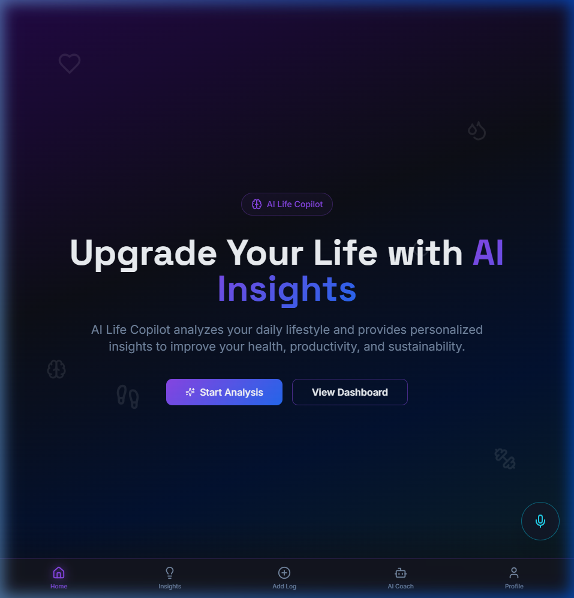
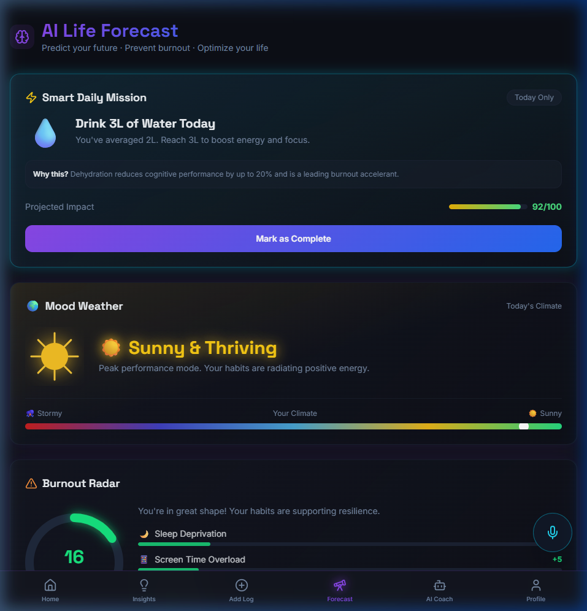
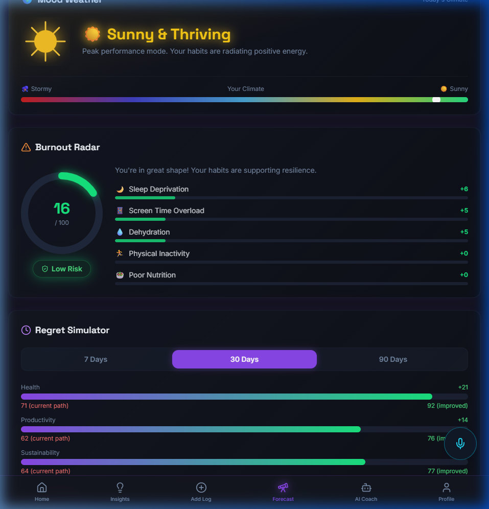
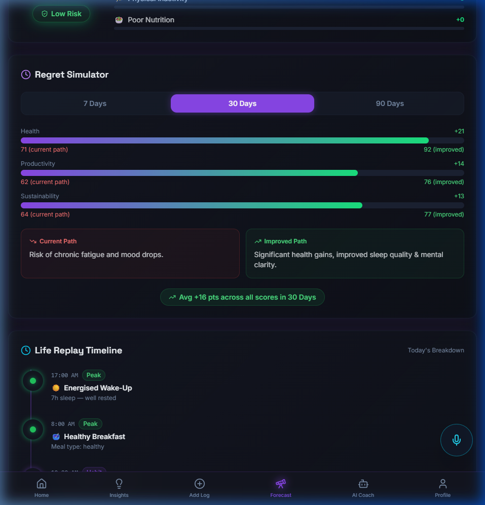
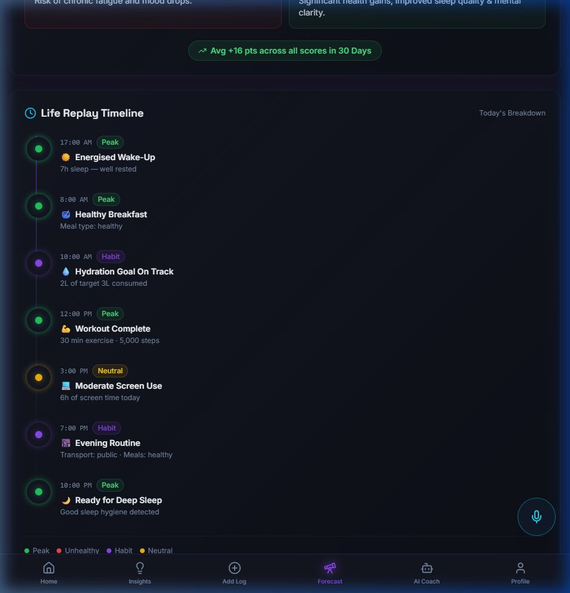
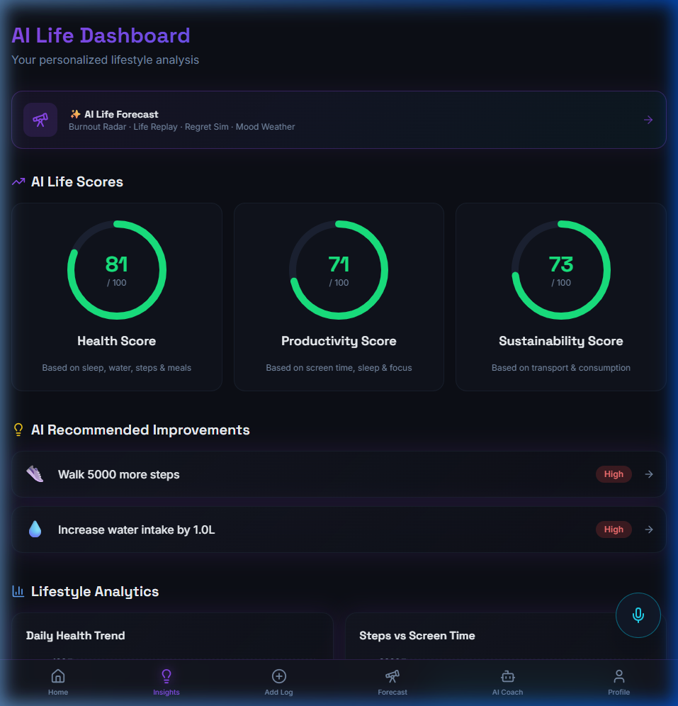

<div align="center">

# 🧬 AI Life Copilot

### Your intelligent lifestyle analytics & AI wellness coach

[](https://react.dev)
[](https://typescriptlang.org)
[](https://vitejs.dev)
[](https://tailwindcss.com)
[](https://supabase.com)
[](https://vapi.ai)

<br />


---

**AI Life Copilot** tracks your daily habits — sleep, hydration, exercise, screen time, diet, and transport — then generates personalized **Health**, **Productivity**, and **Sustainability** scores with AI-powered coaching via text chat and voice.

Now featuring the brand-new **🔮 AI Life Forecast** system — predict burnout before it happens, simulate future outcomes, and receive your daily high-impact mission.

</div>

---

## 📸 Screenshots

### 🏠 Landing Page



---

## ✨ NEW — AI Life Forecast

> **Route:** `/forecast` · **Nav:** Telescope icon in bottom bar · **Entry:** Dashboard banner card

The AI Life Forecast is an intelligent prediction system that analyzes your current habits and forecasts your future lifestyle trajectory — helping you **prevent burnout before it happens**.

### 🔮 Forecast Hub — Overview



The Forecast page opens with your **Smart Daily Mission** (the single highest-impact habit for today, AI-selected) and **Mood Weather** (your lifestyle converted into a weather visual).

---

### ⚠️ Burnout Radar



Analyzes 5 key lifestyle signals and generates a **Burnout Risk Score (0–100)**:

| Signal | Max Contribution |
|--------|-----------------|
| 🌙 Sleep Deprivation | +35 pts |
| 📱 Screen Time Overload | +25 pts |
| 💧 Dehydration | +15 pts |
| 🏃 Physical Inactivity | +15 pts |
| 🥗 Poor Nutrition | +10 pts |

Risk is classified as **Low** / **Medium** / **High** with an animated arc gauge and ranked factor bars.

---

### 🔮 Regret Simulator



Simulates your future health, productivity, and sustainability scores at **7 / 30 / 90 days**:
- **Current Path** — projects trajectory based on existing habits
- **Improved Path** — shows gains from adopting recommended habits
- Animated dual progress bars with ± score deltas and outcome narratives

---

### 📅 Life Replay Timeline



Generates a visual hour-by-hour timeline of your day, highlighting:
- ✅ **Peak moments** — great sleep, healthy meals, exercise wins
- ❌ **Unhealthy moments** — sleep debt, screen overload, dehydration
- 🟣 **Habit checkpoints** — hydration, transport, wind-down routine

---

### 🌤️ Dashboard — Forecast Entry Point



The existing Dashboard gains a **Forecast entry banner** and a mobile quick-grid tile for instant access without disrupting current analytics.

---

## ✨ All Features

| Feature | Description |
|---------|-------------|
| 📊 **Smart Scoring Engine** | Three composite scores (0–100) from 7 lifestyle inputs using weighted algorithms |
| 🤖 **AI Chat Coach** | Real-time streaming chat powered by Google Gemini 3 Flash — personalized to your data |
| 💬 **Chat Threads** | Multiple conversation threads with sidebar, auto-titling and thread management |
| 🎙️ **Voice AI Coach** | Hands-free coaching via [VAPI](https://vapi.ai) voice agent integration |
| 📈 **Visual Analytics** | Recharts dashboards — health trends, steps vs screen time, sleep quality |
| 🎯 **Actionable Recommendations** | AI-generated lifestyle tips ranked by impact level |
| 🔮 **AI Life Forecast** ⭐ NEW | Burnout Radar · Life Replay · Regret Sim · Smart Mission · Mood Weather |
| ⚠️ **Burnout Radar** ⭐ NEW | Risk score (0–100) with top contributing factors and animated gauge |
| 📅 **Life Replay Timeline** ⭐ NEW | Visual day timeline with peak/unhealthy/habit event classification |
| 🎭 **Regret Simulator** ⭐ NEW | 7/30/90-day future outcome simulation with score projections |
| ⚡ **Smart Daily Mission** ⭐ NEW | AI selects the single highest-impact habit for today |
| 🌦️ **Mood Weather** ⭐ NEW | Daily lifestyle converted to Sunny / Partly Cloudy / Rainy / Stormy |
| 🌙 **Dark Glassmorphic UI** | Frosted glass design with purple/cyan gradients and glow effects |
| 📱 **Fully Responsive** | Mobile-first bottom nav + desktop floating dock navigation |
| ⚡ **Blazing Fast** | Vite + React SWC — instant HMR, sub-second builds |

---

## 🏗️ Architecture

```
┌──────────────────────────────────────────────────────────────────┐
│                    Frontend (React + Vite)                        │
│                                                                  │
│   Landing ── LifestyleInput ── Dashboard ── ChatCoach            │
│                   │                │            │   │            │
│                   │           ScoreEngine    Stream  VAPI        │
│                   │           (weighted      SSE    Voice        │
│                   │            algo)         ↓      Agent        │
│                   └──► Forecast (/forecast)  NEW ◄───────────    │
│                          ├── BurnoutRadar                        │
│                          ├── LifeReplayTimeline                  │
│                          ├── RegretSimulator                     │
│                          ├── SmartDailyMission                   │
│                          └── MoodWeatherCard                     │
├──────────────────────────────────────────────────────────────────┤
│           Supabase Edge Functions (Deno)                         │
│           └── ai-coach (streaming proxy)                         │
├──────────────────────────────────────────────────────────────────┤
│   Lovable AI Gateway ──► Google Gemini 3 Flash                   │
│   VAPI Cloud ──► Voice AI Agent                                  │
└──────────────────────────────────────────────────────────────────┘
```

---

## 🚀 Quick Start

### Prerequisites

- **Node.js** ≥ 18
- **npm** or **bun**
- A [Supabase](https://supabase.com) project (for the AI coach edge function)
- _(Optional)_ A [VAPI](https://vapi.ai) account for voice agent

### 1. Clone & Install

```bash
git clone https://github.com/venkatayaswanth-IIITan/Ai-life-copilot-HF26.git
cd Ai-life-copilot-HF26
npm install
```

### 2. Environment Variables

Create a `.env` file in the project root:

```env
VITE_SUPABASE_URL=https://your-project.supabase.co
VITE_SUPABASE_PUBLISHABLE_DEFAULT_KEY=your-supabase-publishable-key

# Optional — enables the voice coach button
VITE_VAPI_PUBLIC_KEY=your-vapi-public-key
```

### 3. Deploy the Edge Function

```bash
supabase functions deploy ai-coach
```

Make sure `LOVABLE_API_KEY` is set in your Supabase project secrets.

### 4. Run

```bash
npm run dev
```

Open **http://localhost:8080** and start tracking your lifestyle.

---

## 🔮 AI Life Forecast — Deep Dive

Navigate to `/forecast` or tap **Forecast** in the bottom navigation bar.

### How It Works

1. **Log your daily habits** at `/input` (sleep, water, steps, meals, screen time, exercise, transport)
2. Navigate to **AI Life Forecast** — the engine computes all predictions instantly
3. Results are **cached in `localStorage`** — the forecast recomputes only when habit data changes

### Feature Breakdown

#### ⚠️ Burnout Radar
Calculates a weighted risk score across 5 burnout signals. Sleep deprivation contributes the most (+35 max), followed by screen overload (+25). The gauge animates from 0 to your score with color-coded glow (green = Low, yellow = Medium, red = High).

#### 📅 Life Replay Timeline
Generates 7 time-stamped events across your day based on your logged data. Each event is classified:
- 🟢 **Peak** — optimal habits (e.g., Energised Wake-Up, Workout Complete)
- 🔴 **Unhealthy** — risk habits (e.g., Sleep Debt, Screen Overload)
- 🟡 **Neutral** — average habits
- 🟣 **Habit** — tracked checkpoints (hydration, transport)

#### 🎭 Regret Simulator
Builds an "ideal" version of your lifestyle data (target: 7.5h sleep, 3L water, 10K steps, 45min exercise, ≤5h screen). Projects both current and improved scores forward using compound-gain math with diminishing returns:

```
improved_score = base + delta × (1 - e^(-days/60)) × 1.5
```

#### ⚡ Smart Daily Mission
Scores each habit deficit by urgency and selects the single most impactful habit to fix today. Includes a science-backed "Why this?" explanation and a completable progress bar.

#### 🌦️ Mood Weather
Maps your average score + burnout level to a 5-state weather system with custom SVG animated illustrations (rays, raindrops, lightning bolts) and a rainbow climate scale slider.

---

## 🎙️ Voice AI Coach (VAPI)

The AI Coach page includes a **voice agent** powered by [VAPI](https://vapi.ai). When configured, a microphone button appears in the chat header.

**How it works:**

1. Tap the 🎤 mic icon in the AI Coach header
2. A full-screen voice overlay opens with real-time audio visualization
3. Speak naturally — the VAPI voice agent responds as your wellness coach
4. Voice transcripts are added to the chat history
5. Mute/unmute and end the call with on-screen controls

**Setup:**

1. Create a VAPI account at [vapi.ai](https://vapi.ai)
2. Create or configure an assistant
3. Copy your **Public Key** from the VAPI dashboard
4. Set `VITE_VAPI_PUBLIC_KEY` in your `.env` file
5. The mic button will appear automatically

> Without the VAPI key, the app works normally with text-only chat.

---

## 📊 Scoring Algorithm

Each score is calculated from weighted lifestyle inputs:

### Health Score (0–100)

| Input        | Weight | Target   |
| ------------ | ------ | -------- |
| Sleep        | 25%    | 8 hours  |
| Water Intake | 25%    | 3 liters |
| Steps        | 25%    | 10,000   |
| Meals        | 5–25%  | Healthy  |
| Exercise     | 10%    | 60 min   |

### Productivity Score (0–100)

| Input       | Weight | Target               |
| ----------- | ------ | -------------------- |
| Screen Time | 35%    | Low (penalizes >12h) |
| Sleep       | 35%    | 8 hours              |
| Exercise    | 15%    | 60 min               |
| Meals       | 3–15%  | Healthy              |

### Sustainability Score (0–100)

| Input       | Weight | Target      |
| ----------- | ------ | ----------- |
| Transport   | 40%    | Walk / Bike |
| Meals       | 5–30%  | Healthy     |
| Water       | 15%    | Efficient   |
| Screen Time | 15%    | Low         |

---

## 🛠️ Tech Stack

| Layer             | Technology                                 |
| ----------------- | ------------------------------------------ |
| **Framework**     | React 18 + TypeScript                      |
| **Build**         | Vite 5 + SWC                               |
| **Styling**       | Tailwind CSS 3 + custom glassmorphic theme |
| **Components**    | Shadcn UI (Radix primitives)               |
| **Animations**    | Framer Motion                              |
| **Charts**        | Recharts                                   |
| **Forms**         | React Hook Form + Zod                      |
| **Data Fetching** | TanStack React Query                       |
| **Backend**       | Supabase (Auth, DB, Edge Functions)        |
| **AI Model**      | Google Gemini 3 Flash via Lovable Gateway  |
| **Voice AI**      | VAPI Web SDK                               |
| **Testing**       | Vitest + Testing Library                   |

---

## 📁 Project Structure

```
src/
├── pages/
│   ├── Landing.tsx           # Hero landing page
│   ├── LifestyleInput.tsx    # Daily data entry (7 sliders)
│   ├── Dashboard.tsx         # Scores, charts, recommendations
│   ├── Forecast.tsx          # ⭐ NEW: AI Life Forecast hub page
│   ├── ChatCoach.tsx         # AI chat + voice agent
│   └── Profile.tsx           # User settings & auth
├── components/
│   ├── BottomNav.tsx         # Responsive nav (mobile bar + desktop dock)
│   ├── CircularProgress.tsx  # Animated SVG score rings
│   ├── VoiceOverlay.tsx      # VAPI voice call UI
│   ├── forecast/             # ⭐ NEW: Forecast feature components
│   │   ├── BurnoutRadar.tsx        # Burnout risk gauge + factors
│   │   ├── LifeReplayTimeline.tsx  # Animated day timeline
│   │   ├── RegretSimulator.tsx     # 7/30/90-day simulator
│   │   ├── SmartDailyMission.tsx   # AI habit mission card
│   │   └── MoodWeatherCard.tsx     # SVG weather illustration
│   └── ui/                   # Shadcn UI components
├── hooks/
│   ├── use-vapi.ts           # VAPI voice agent hook
│   ├── useChatThreads.ts     # Multi-thread chat state
│   └── use-toast.ts          # Toast notifications
├── lib/
│   ├── store.ts              # LifestyleData types + scoring engine
│   ├── forecastEngine.ts     # ⭐ NEW: Forecast computation engine
│   └── utils.ts              # Utility functions (cn)
└── integrations/
    └── supabase/
        ├── client.ts         # Supabase client init
        └── types.ts          # Database types

supabase/
└── functions/
    └── ai-coach/
        └── index.ts          # Streaming AI coach edge function

public/
└── screenshots/              # ⭐ NEW: App screenshots for README
    ├── landing.png
    ├── forecast_hero.png
    ├── burnout_radar.png
    ├── regret_simulator.png
    ├── life_replay_timeline.png
    └── dashboard_forecast_banner.png
```

---

## 📜 Scripts

| Command              | Description              |
| -------------------- | ------------------------ |
| `npm run dev`        | Start development server |
| `npm run build`      | Production build         |
| `npm run preview`    | Preview production build |
| `npm run lint`       | Lint with ESLint         |
| `npm run test`       | Run tests (Vitest)       |
| `npm run test:watch` | Run tests in watch mode  |

---

## 🤝 Contributing

1. Fork the repository
2. Create a feature branch (`git checkout -b feature/amazing-feature`)
3. Commit your changes (`git commit -m 'Add amazing feature'`)
4. Push to the branch (`git push origin feature/amazing-feature`)
5. Open a Pull Request

---

## 📄 License

This project is licensed under the MIT License.

---

<div align="center">

**Built with 💜 by AI Life Copilot team**

_Track smarter. Live better. Forecast your future._

</div>
